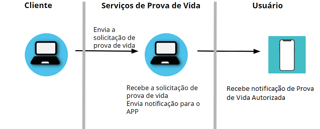
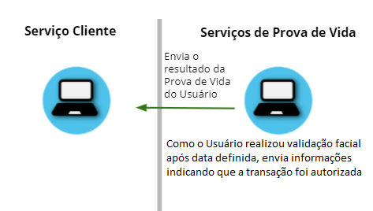
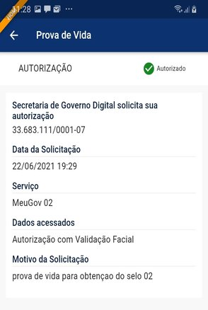
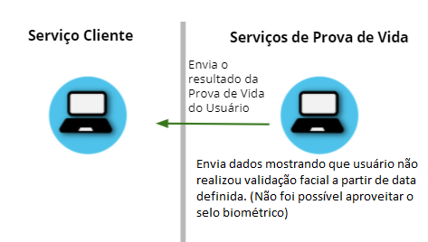
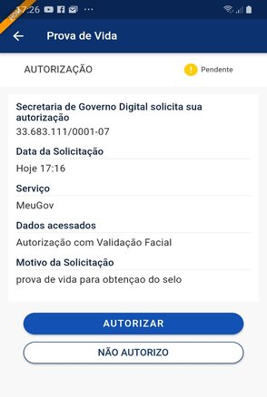

Funcionamento da Prova de Vida
===============================

Transação autorizada automaticamente
++++++++++++++++++++++++++++++++++++++++

Abaixo está uma descrição geral do procedimento da Prova de Vida autorizada automaticamente.

1. Aplicação **Cliente** envia transação para verificar Validação facial feita pelo usuário a partir de uma data definida

2. Aplicação **Cliente** recebe os dados da transação autorizada automaticamente. **Usuário**, abrindo as notificações do aplicativo "Meu Gov.Br", visualiza os dados da Prova de Vida **autorizada**

.. figure:: _images/app.png
   :align: center
   :alt: 

Transação **não** autorizada automaticamente
++++++++++++++++++++++++++++++++++++++++++++++++

Abaixo está uma descrição geral do procedimento da Prova de Vida **não** autorizada automaticamente. Quando a Aplicação **Cliente** não consegue aproveitar validação facial feita pelo usuário anteriormente.

1. Aplicação **Cliente** envia transação solicitando a Prova de Vida

.. figure:: _images/clienteSolicitacao.png
   :align: center
   :alt: 

2. Aplicação **Cliente** recebe resposta da solicitação, indicando que **não** foi feita validação facial

3. **Usuário**, abrindo as notificações do aplicativo “Meu Gov.Br”, recebe os dados da solicitação, a qual aparece como **pendente**

4. **Usuário** autoriza solicitação de Prova de Vida

5. **Usuário**, por meio do aplicativo, realiza a Validação facial. A Validação verifica se quem está realizando o procedimento é uma pessoa viva. Em seguida, é validado se quem está realizando o procedimento corresponde a biometria facial armazenada nas bases do TSE ou CNH

.. figure:: _images/validacaoApp.png
   :align: center
   :alt: 
	
6. Aplicação **Cliente** solicita informação sobre a Prova de Vida enviada

.. figure:: _images/solicitacaoResPv.png
    :align: center
    :alt:

7. Aplicação **Cliente** recebe resposta da solicitação	

.. figure:: _images/resultadoPv.png
    :align: center
    :alt:

**Observação:**

- Quando a transação **não** é autorizada automaticamente, o **usuário** precisa responder a solicitação de Prova de Vida no Aplicativo. Dessa Forma, a aplicação **cliente** tem a resposta mostrando se o **usuário** autorizou ou não a Prova de Vida.

Na próxima seção, as formas de chamadas e parâmetros das transações são apresentados mais detalhadamente.
