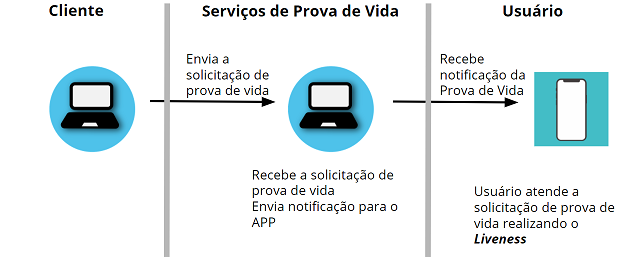
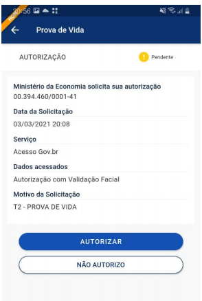
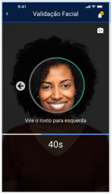
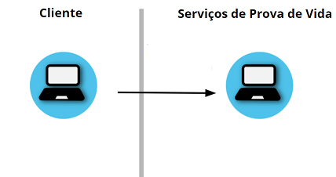
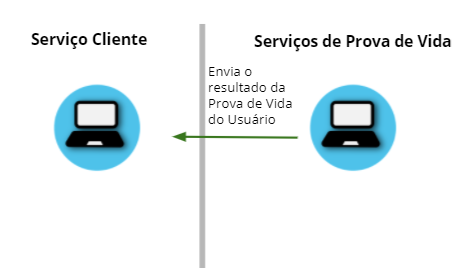

Funcionamento da Prova de Vida
===============================

Abaixo está uma descrição geral do procedimento da Prova de Vida.

1. Aplicação **Cliente** envia transação solicitando a Prova de Vida

2. **Usuário**, abrindo as notificações do aplicativo "Meu Gov.Br", recebe os dados da solicitação, tais como: **Nome da aplicação** que solicitou e **Data da solicitação**. 

3. **Usuário** autoriza solicitação de Prova de Vida   

4. **Usuário**, por meio do aplicativo, realiza a Validação facial. A Validação verifica se quem está realizando o procedimento é uma pessoa viva. Em seguida, é validado se quem está realizando o procedimento corresponde a biometria facial armazenada nas bases do TSE ou CNH

	
5. Aplicação **Cliente** solicita informação sobre a Prova de Vida

6. Aplicação **Cliente** recebe resposta da solicitação	

Para que a resposta da transação (serviço) realizada pela aplicação **cliente** mostre se o **usuário** autorizou ou não a Prova de Vida, o **usuário** precisa responder a solicitação no Aplicativo.

As transações enviadas pela aplicação **cliente** também podem retornar informações de validação facial realizada anteriormente (**Selo Biométrico**). Dessa forma, a solicitação da prova de vida pode ser autorizada automaticamente, sem a necessidade do usuário fazer a validação facial após a solicitação. Nesse caso, a aplicação **cliente** cria a transação com verificação de selo de Biometria Facial. 

Na próxima seção, as formas de chamadas e parâmetros das transações são apresentados mais detalhadamente.
